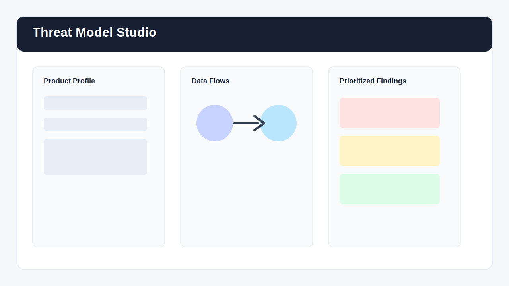

# Threat Model Studio

Threat Model Studio is a zero-install browser app for turning a product idea into a structured security threat model. It helps teams identify assets, trust boundaries, data flows, likely STRIDE threats, mitigations, and an exportable security review summary.



## Why this project is portfolio-ready

- Practical cybersecurity workflow with STRIDE-based analysis
- No backend required, so it can run on GitHub Pages
- Clean separation between UI state, rule logic, scoring, and export formatting
- Includes sample data, browser-friendly app code, and automated logic tests
- Designed for recruiters to understand quickly and for engineers to inspect deeply

## Features

- Product profile builder for architecture, users, data sensitivity, and deployment model
- Asset and data-flow workspaces with add, edit, and remove actions
- STRIDE detection rules that map flows and assets to realistic threat scenarios
- Risk scoring based on severity, likelihood, exposed surfaces, and missing controls
- Mitigation planner with status tracking
- Markdown export for GitHub issues, security reviews, or audit notes
- Local-only operation: no data leaves the browser

## Quick Start

Open `index.html` in a browser.

For automated logic tests, run:

```powershell
node .\tests\threat-engine.test.js
```

If Node.js is not installed, the app still works by opening the HTML file directly.

## Project Structure

```text
threat-model-studio/
  index.html              App shell
  styles.css              Responsive interface styling
  app.js                  UI controller and local state
  src/threat-engine.js    STRIDE rules, risk scoring, export logic
  data/sample-project.json
  tests/threat-engine.test.js
  docs/preview.svg
```

## Example Use Case

A team is building a SaaS document-sharing platform. They enter their core assets, mark the deployment as internet-facing, add data flows such as browser-to-API and API-to-database, then generate a prioritized threat model. The output highlights authentication, tampering, data exposure, denial-of-service, and auditability concerns.

## Security Notes

This is an educational and planning tool, not a replacement for a formal penetration test, secure design review, or compliance assessment. Treat its findings as a starting point for engineering discussion.

## Roadmap

- Save and load project files
- Add custom organization controls
- Add attack-tree view
- Add GitHub issue export format
- Add OWASP ASVS mapping

